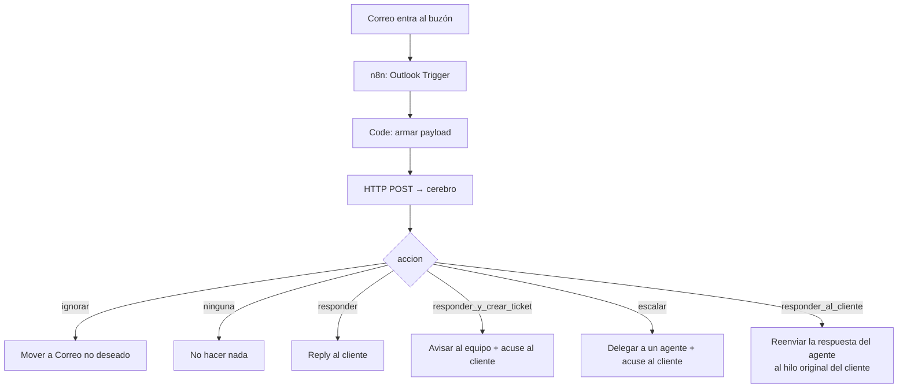

# Asistente de soporte con IA — Documentación del proyecto

**Piloto SAC · Santillana Ecuador**
Documento de entrega · versión correspondiente al código en `apps/cerebro` y `n8n/`

---

## Alcance de este documento

Describe el **asistente de inteligencia artificial** que atiende el buzón de soporte por correo
electrónico: cómo decide, qué puede hacer, qué garantías tiene y cómo se opera.

Quedan **fuera** de este documento, por corresponder a otro módulo del proyecto, la **carga de
credenciales** (subida masiva desde Excel) y la **consulta manual de credenciales** por parte del
personal interno. Sí se documenta, en cambio, la capacidad del asistente de **buscar credenciales
para responderle a un usuario**, porque es una de sus funciones centrales.

---

## 1. Qué resuelve

El buzón de soporte de Santillana Ecuador recibe correos de representantes, docentes y personal de
las instituciones. La mayoría son solicitudes repetitivas y bien acotadas: *no tengo el usuario de mi
hijo*, *olvidé la contraseña*, *dónde está el PIN del libro*, *no veo mis clases*.

El asistente atiende esas solicitudes de principio a fin sin intervención humana, y **deriva a una
persona** todo lo que no puede resolver, dejando el caso documentado para que quien lo reciba no
tenga que volver a preguntarle nada al usuario.

Cuatro propiedades guían todo el diseño:

1. **Nunca prometer lo que no ocurrió.** Si el sistema no puede crear un ticket o asignar un caso, no
   le dice al usuario que sí.
2. **Nunca filtrar datos de terceros.** Jamás se enumeran nombres de otros estudiantes.
3. **Nunca entrar en bucle.** El sistema no puede responderse a sí mismo.
4. **Ante la duda, preguntar.** Es preferible pedir un dato más que resolver mal.

---

## 2. Arquitectura

| Pieza | Qué es | Rol |
|---|---|---|
| **`apps/cerebro`** | AWS Lambda (imagen de contenedor) con Function URL | El asistente: recibe cada correo, decide con IA, ejecuta herramientas, redacta la respuesta y sirve el dashboard |
| **n8n** (self-hosted) | Orquestador | Vigila el buzón vía Microsoft Graph, llama al cerebro y ejecuta lo que este decide (responder, avisar, mover a spam) |
| **MongoDB** | Base de datos | Conversaciones, casos/tickets derivados, correos descartados, consentimientos |
| **Google Gemini** | Modelo de lenguaje | Interpreta la intención y redacta las respuestas, mediante *function calling* |

El reparto de responsabilidades es deliberado: **n8n nunca decide nada**. Se limita a mover correos.
Toda la lógica vive en el cerebro, que es código versionado y testeable; el flujo visual queda como
un conector delgado, fácil de reconstruir si se pierde.

Al ser Lambda, el asistente es **sin estado**: en cada invocación reconstruye el historial de la
conversación desde MongoDB. No hay memoria en proceso que se pueda perder entre correos.

---

## 3. Cómo decide: el orden importa

Ante cada correo entrante, el asistente resuelve en este orden. Cada paso corta el flujo si aplica —
así el más barato y el más peligroso se evalúan primero.

| # | Pregunta | Si la respuesta es sí | Coste |
|---|---|---|---|
| 1 | ¿El remitente es un buzón nuestro? | Se descarta (`accion: ninguna`) | Nulo |
| 2 | ¿Es la respuesta de un agente a un caso delegado? | Se reenvía al hilo original del cliente | Sin IA |
| 3 | ¿El remitente es interno y no hay derivación pendiente? | Se descarta | Nulo |
| 4 | ¿Es basura (publicidad, rebote, auto-reply)? | Se descarta y n8n lo mueve a spam | Sin IA |
| 5 | ¿Ya se respondió este mensaje? | Se descarta por duplicado | Sin IA |
| 6 | ¿El cliente aceptó la política de datos? | Si no, se le envía y se espera | Sin IA |
| 7 | Es una consulta real | Va a Gemini con herramientas | Una llamada al modelo |

Los pasos 1 a 6 existen para que **la publicidad y los rebotes no consuman cuota de IA**, que era el
gasto principal antes de introducirlos.

---

## 4. Las herramientas del asistente

El modelo no escribe respuestas libres sobre datos: para actuar debe llamar a una herramienta. Son
seis, con esquema de parámetros estricto.

### `buscar_credenciales`
Busca el usuario y la contraseña de un estudiante. Usa coincidencia difusa, porque los nombres de
colegio llegan escritos de mil formas. Devuelve un estado que determina qué hace el asistente:

| Estado | Significado | Qué hace el asistente |
|---|---|---|
| `OK` | Coincidencia única y confiable | Entrega las credenciales y la plataforma |
| `HOMONIMOS` | Varios colegios con nombre parecido | Muestra las opciones con ciudad y cantón, y pide confirmar |
| `COLEGIO_NO_ENCONTRADO` | Sin coincidencia de institución | Sugerencias → pregunta por otro nombre → deriva |
| `ESTUDIANTE_NO_ENCONTRADO` | El colegio existe, el estudiante no | Pide verificar datos; si falla otra vez, deriva |
| `CANDIDATOS` | Varias coincidencias parciales de estudiante | **Pide el nombre completo. Nunca lista los candidatos** |
| `SIN_COLEGIOS` | No hay colegios cargados | Lo informa |

`CANDIDATOS` es el estado más delicado del sistema: enumerar los estudiantes que coinciden sería
revelar datos personales de otros alumnos a quien no tiene por qué conocerlos. La prohibición está
escrita en el prompt y repetida en la regla de privacidad.

### `crear_ticket`
Para reseteos de contraseña (equipo **Cuentas**) e incidencias de plataforma (equipo **Servicio
Digital**). El equipo que lo atiende **no ve el hilo de correo**, así que el ticket viaja con todo lo
necesario dentro.

### `derivar_a_agente_digital`
Deriva el caso a una persona concreta. Se usa cuando la búsqueda falló *después* de haber preguntado,
o cuando la consulta es de Santillana pero no encaja en ninguna función automática.

### `consultar_estudiantes_activos`
Cuántos estudiantes de un colegio tienen credenciales cargadas. Acepta el id de Pegasus o el nombre.

### `info_pin`
Mini tutorial de dónde está el PIN del libro de *Compartir* (impreso en la contraportada). No existe
forma automática de validar un PIN, y el asistente tiene prohibido prometer que lo hará.

### `fuera_de_alcance`
Para consultas sin relación con Santillana. Es **obligatorio llamarla**: el texto de rechazo lo
genera la herramienta, no el modelo, para que siempre ofrezca los temas que sí se atienden. El prompt
prohíbe explícitamente escribir "no puedo ayudarte" por cuenta propia.

---

## 5. Las garantías duras

Un *prompt* es una instrucción, no una garantía. Estas tres protecciones son código, y se cumplen
aunque el modelo se equivoque.

### 5.1 Puerta de datos mínimos

El modelo tendía a crear tickets y derivar casos con todos los campos en *"no proporcionado"*,
dejando al agente humano sin nada con que trabajar. Ahora la herramienta **no se ejecuta** si faltan
datos: devuelve `FALTA_INFORMACION` con la lista exacta de lo que hay que preguntar.

Los datos se piden siempre en el mismo orden, definido una sola vez en el código para que el prompt
y la validación no puedan desincronizarse:

1. Nombre completo del estudiante
2. Unidad educativa (colegio)
3. Ciudad (provincia)
4. Nivel
5. Paralelo
6. *(solo en incidencias)* Detalle minucioso del problema

> **El cantón no se pide de entrada.** Casi nadie lo sabe de memoria y solo sirve para desempatar
> colegios homónimos. Se pide después, y únicamente si la búsqueda lo necesitó. Pedirlo a todo el
> mundo alargaba cada conversación para resolver unos pocos casos.

Se rechazan los rellenos: `"n/a"`, `"no proporcionado"`, `"se desconoce"` y dos docenas de variantes
no cuentan como dato. Un solo carácter **sí** cuenta si es alfanumérico, porque los paralelos son
literalmente `"A"` y `"B"`.

Para derivar hay una regla adicional: **no se deriva sin haber preguntado antes**. En el primer
correo del hilo solo se permite si el usuario ya escribió un caso completo por su cuenta (se exige
una descripción más larga: 120 caracteres frente a 60 en turnos posteriores). La única excepción es
que el usuario haya dicho explícitamente que no tiene esos datos.

### 5.2 Detector de promesas sin acción

El modelo a veces escribía *"hemos generado el ticket"* sin haber llamado a `crear_ticket`, o incluía
códigos inventados como `[código del caso]`. El usuario quedaba esperando una gestión que no existía.

Antes de enviar cualquier respuesta se comprueba el texto contra un catálogo de formas de prometer.
Si detecta una promesa sin la herramienta correspondiente ejecutada, **la respuesta no se envía**: se
le devuelve el error al modelo y se le obliga a ejecutar la acción o a reescribir sin prometerla.

### 5.3 Invariantes de destinatario

Un caso sin agente asignado, o un ticket sin equipo, no lo atiende nadie — y al cliente ya se le
habría dicho que sí. Si ocurre, se aborta toda la respuesta y se devuelve **503** para que n8n
reintente más tarde, dejando el correo **sin marcar como respondido**. Es preferible el silencio
temporal a una promesa falsa.

El mismo criterio se aplica cuando falla el proveedor de IA (cuota agotada, límite de peticiones): no
se responde nada, se registra el motivo y **el correo pasa a la cola** (ver el apartado siguiente).

---

## 5b. Gestión de la cuota: la cola de correos

El piloto opera en el nivel gratuito del proveedor de IA, que tiene dos límites distintos y conviene
no confundirlos: uno **por minuto**, que se recupera solo en segundos, y uno **diario**, que tarda
horas. Reintentar un límite diario cada cinco segundos no arregla nada y quema invocaciones.

La gestión de la cuota tiene cuatro reglas.

**1. Ningún correo se pierde.** El mensaje del usuario se guarda en su conversación *antes* de llamar
al modelo, así que un fallo del proveedor deja el trabajo pendiente como **estado en la base de
datos**, no como un mensaje en tránsito. La cola no necesitó infraestructura nueva: se marca la
conversación y se ordena.

Esto importa porque el disparador de Outlook **no vuelve a entregar un correo ya entregado**. Sin la
cola, los reintentos cortos de n8n se agotaban en quince segundos y el mensaje quedaba sin responder
para siempre.

**2. Espera creciente, y distinta según la causa.** Reintentar antes de que la cuota vuelva solo
gasta intentos.

| Intento | Cuota agotada (suele ser diaria) | Error puntual del proveedor |
|---:|---:|---:|
| 1.º | 30 min | 5 min |
| 2.º | 1 h | 15 min |
| 3.º | 2 h | 30 min |
| 4.º | 4 h | 1 h |
| 5.º y siguientes | 6 h | 2 h |

**3. Se drena por lotes pequeños, en orden de llegada.** Cinco correos por corrida, el que más lleva
esperando primero. Vaciar la cola de golpe con la cuota recién repuesta la agotaría en la primera
tanda y dejaría a los demás igual de atascados. Si un correo del lote vuelve a fallar por cuota, la
corrida **se corta**: los siguientes fallarían igual.

**4. La cola tiene salida.** Pasadas **12 horas** esperando, el correo deja de esperar a la IA y se
**delega a una persona**, con el aviso correspondiente al cliente. Una cola sin salida es una cola
donde los correos se pudren en silencio.

El drenaje lo dispara `workflow-drenar-cola.json` cada quince minutos; el ritmo real lo decide el
cerebro con las esperas de arriba, así que el flujo puede correr seguido sin efectos secundarios.
`GET /?reporte=cola` devuelve cuántos esperan y desde cuándo — una cola que crece sin que nadie se
entere es la peor forma de fallar.

---

## 6. Consentimiento de datos (LOPDP)

> **El consentimiento de protección de datos no es una aceptación de términos y condiciones.** Un
> «acepto» suelto no sirve como prueba. La norma exige un **registro individual** por consentimiento,
> que identifique a quien lo otorga, a quién representa, con qué relación, para qué finalidad, y si lo
> otorgó o no.

El flujo es enteramente por correo: no hay página web ni el mensaje ejecuta nada.

1. El cliente escribe. El asistente responde con la **política** y deja el hilo en
   `esperando_consentimiento`. La solicitud no se atiende todavía.
2. El representante responde con **«Sí»** y ocho campos. Cuando están completos y válidos se crea el
   registro y se atiende la **solicitud original**, que sigue en el historial del hilo.
3. Si responde **a medias**, se le piden solo los campos que faltan, con el motivo concreto.
4. Si **niega** el consentimiento, la negativa **queda registrada** (`¿Otorgado? = No`) y su solicitud
   pasa a un agente humano. No se le deja sin atención por no consentir.
5. Si **no responde en 48 horas**, un proceso programado delega la solicitud a un agente, que le
   responderá en 48 a 52 horas.

### Los campos del registro

| Campo | Notas |
|---|---|
| Fecha · Hora | Separadas, en hora de Ecuador (`America/Guayaquil`) |
| Nombres · Apellidos · Cédula/ID **del representante legal** | |
| Parentesco / Relación | |
| Nombres · Apellidos · Cédula/ID **del estudiante** | |
| Finalidad del consentimiento | Una sola, enunciada en el correo de política |
| ¿Otorgado? | `Sí` / `No` — **la negativa también se registra** |

Se guarda además el **texto literal** que escribió el representante, como prueba de lo que consintió.

La finalidad es única y global, pero el correo de política enumera los **tres tratamientos concretos**
que cubre, para que el «Sí» sea informado: uso de IA de un tercero para leer el correo y validar la
identidad, tratamiento de los datos del menor para entregar credenciales, y almacenamiento fuera del
Ecuador.

### Cómo se interpreta la respuesta

El parseo acepta lo que la gente escribe de verdad: campos en cualquier orden, con o sin guiones o
numeración, con o sin tildes, nombres y apellidos juntos o separados, y el «Sí» en su propia línea o
como valor de una etiqueta. Si escriben el nombre completo en el campo de nombres, se reparte solo, en
vez de pedirles un dato que ya dieron.

Las **cédulas ecuatorianas se validan con su dígito verificador** (módulo 10, más provincia y tipo de
persona). Un error de tipeo se detecta y se pide corregirlo indicando exactamente cuál falla; sin esa
comprobación el registro se llenaría de números inválidos y no probaría nada. Se aceptan también
pasaporte y documento extranjero, marcados como no verificados, para no bloquear a representantes no
ecuatorianos.

Una negativa explícita («no acepto») escrita en cualquier parte del correo manda sobre todo lo demás.

### Reporte

`GET /?reporte=consentimientos` devuelve el registro con las once columnas en el orden exigido; con
`&formato=csv` se descarga listo para archivar o entregar a auditoría. Admite `desde` y `hasta`. Va
protegido por token: contiene datos personales de menores.

**Alcance configurable:** por defecto se pide en **cada solicitud** (`CONSENTIMIENTO_ALCANCE=correo`).
Con `=cliente` se pide una vez por dirección y dura lo que indique `CONSENTIMIENTO_VIGENCIA_DIAS`. El
registro individual se escribe **siempre**, en ambos alcances: es el artefacto legal, mientras que la
marca de alcance es solo la puerta operativa.

---

## 7. Ticket y caso: dos caminos hacia una persona

|  | **Ticket** | **Caso (derivación)** |
|---|---|---|
| Cuándo | Reseteo de clave, incidencia de plataforma | El asistente no pudo resolverlo |
| Lo atiende | Un **equipo** (Cuentas / Servicio Digital) | Un **agente digital** concreto |
| Qué recibe el cliente | Acuse: *"una persona atenderá tu caso"* | Acuse con el **código del caso** |
| Qué recibe quien atiende | Aviso interno con todos los datos | Correo de delegación con todos los datos |

### El viaje de vuelta

Es la pieza que hace que el sistema se sienta continuo para el usuario.

Cuando n8n envía el aviso o la delegación, **registra en el cerebro el identificador del hilo** de ese
correo. Cuando la persona responde a su aviso, el asistente lo reconoce por ese identificador —**no
por el texto del asunto**— y reenvía la respuesta al **hilo original del cliente**.

Antes de reenviarla se le quitan el saludo, la firma personal del agente y el hilo citado debajo, y se
le pone la firma corporativa. **El cliente nunca ve códigos internos** (`CASO-…`, `PENDIENTE-…`) ni
sabe que hubo un intermediario.

El reconocimiento por asunto se conserva solo como respaldo, y con una guarda: únicamente se acepta si
el correo viene de **quien atiende** la derivación. El aviso lleva el código en el asunto y un cliente
podría citarlo al responder; sin esa comprobación, la respuesta del propio cliente cerraría el caso.

### Reparto de casos entre agentes

Se asigna al agente con **menos casos abiertos**, no con menos casos históricos. Un agente que resolvió
sus diez casos vuelve a estar disponible; el que acumula tres sin responder no recibe más hasta
descargarse. Los empates se rompen por quién lleva más tiempo sin recibir un caso, y finalmente por
orden alfabético para que el resultado sea reproducible.

Los tickets no entran en este reparto: van a un buzón de equipo fijo.

---

## 8. Filtro de ruido

El buzón recibe publicidad, newsletters, notificaciones automáticas, avisos de ausencia y rebotes de
entrega. Responderlos es ruido; entre dos sistemas automáticos, un bucle.

El criterio es asimétrico a propósito: **es preferible dejar pasar un correo dudoso que descartar una
consulta real.**

- **Señales fuertes** (descartan por sí solas): asunto o cuerpo de rebote, respuesta automática de
  ausencia, remitente tipo `no-reply@`/`mailer-daemon@`, dominio de envío masivo conocido.
- **Publicidad**: hacen falta **dos** señales simultáneas (pie de "cancelar suscripción", llamadas a la
  acción de campaña, ganchos comerciales…). Una sola aparece a veces en correos legítimos.
- **Excepción que manda sobre todo lo anterior**: si el texto contiene una **intención de soporte
  clara** (*credenciales*, *contraseña*, *PIN*, *no puedo ingresar*, *unidad educativa*…), el correo se
  atiende aunque arrastre señales publicitarias — típicamente la firma corporativa del colegio con un
  "síguenos en" al pie.

Los rebotes se detectan **por asunto o por cuerpo**: a veces el asunto es el del correo original y la
señal solo aparece dentro.

Todo descarte queda registrado con su categoría y la señal que lo activó. Sin ese registro el filtro
sería una caja negra imposible de afinar.

---

## 9. Protección anti-bucle

Un sistema que envía correos y vigila el buzón donde caen puede responderse a sí mismo
indefinidamente. Hay **tres capas** independientes:

1. **Lista de buzones propios.** Todo correo cuyo remitente sea un buzón de soporte lo enviamos
   nosotros: se descarta antes de tocar la base de datos.
2. **Cuenta de soporte del hilo.** En una respuesta al cliente el destinatario es el cliente, así que
   comparar con el "para" no basta. La conversación guarda cuál es su cuenta de soporte y se compara
   contra ella.
3. **Remitente interno sin derivación pendiente.** Un agente que responde a un aviso ya resuelto no
   debe convertirse en una conversación de cliente. Sin esta capa, el cierre automático por
   inactividad terminaba escribiéndole al agente un correo de *"cerramos tu caso"*.

Además, n8n vigila **solo la Bandeja de entrada**, no las carpetas de elementos enviados.

---

## 10. Privacidad y seguridad

- **Credenciales cifradas** (AES-256-GCM) en la base de datos. Se descifran solo para entregarlas a
  quien las pidió, y solo tras una coincidencia única.
- **Prohibido enumerar estudiantes.** Ante varias coincidencias, se piden más datos; nunca se muestra
  una lista de posibles alumnos.
- **El cliente no ve nada interno**: ni códigos de caso o ticket, ni el correo del agente, ni que hubo
  una derivación.
- **Cierre por inactividad**: las conversaciones que quedan esperando datos se cierran a las 24 h con
  un aviso — pero **nunca a una dirección interna**; esas se cierran en silencio.
- **El dashboard exige token** (`DASHBOARD_TOKEN`), porque contiene datos personales y volúmenes del
  piloto.

---

## 11. Modelo de datos

| Colección | Guarda | Campos clave |
|---|---|---|
| `conversaciones` | Un documento por hilo de correo | `_id` = id del hilo, `remitente`, `asunto`, `estado`, `mensajes[]`, `eventos[]`, `tickets[]` |
| `escalamientos` | Un documento por caso o ticket derivado | `_id` = código, `tipo` (`caso`\|`ticket`), `hiloId` original, `agenteEmail`, `estado`, `respuestaAgente`, `conversationIdDelegacion` |
| `descartes` | Cada correo basura descartado | `remitente`, `asunto`, `categoria`, `senal` |
| `consentimientos` | **Un registro individual por consentimiento**, otorgado o negado | `fecha`, `hora`, `representante{nombres,apellidos,cedula,correo}`, `representado{…}`, `parentesco`, `finalidad`, `otorgado`, `textoOriginal` |

**La fuente de verdad de la analítica son los `eventos`** de cada conversación, no contadores
independientes. Así una métrica nueva se puede calcular hacia atrás sobre todo el histórico, y no
existe el riesgo de que un contador se desincronice de los hechos.

### Estados de una conversación

| Estado | Significa | Quién debe actuar |
|---|---|---|
| `abierto` | Recién creada | El sistema |
| `esperando_consentimiento` | Se envió la política | El cliente (48 h → se delega) |
| `esperando_usuario` | Se le pidieron datos | El cliente (24 h → se cierra) |
| `esperando_agente` | Derivado a una persona | El agente |
| `resuelto` | Se entregó lo pedido | Nadie |
| `cerrado` | Fuera de alcance (terminal) | Nadie |
| `cerrado_inactividad` | El cliente no respondió | Nadie |

Solo `esperando_usuario` es candidato al cierre automático.

> **Nota de comportamiento.** Si un ticket se resuelve y el cliente escribe **otro** problema en el
> mismo hilo, se crea un **ticket nuevo** enlazado al anterior, en vez de reabrir el viejo. Así no se
> mezclan categorías ni tiempos de resolución.

---

## 12. Dashboard

Una página autocontenida servida por la misma Lambda, en `?vista=dashboard`. Dos capas:

- **Agregados**: embudo de resolución, tasa de automatización, tiempos (mediana y p90), credenciales
  entregadas, carga por agente, ruido filtrado y salud del sistema.
- **Conversaciones**: tabla de cada hilo con búsqueda, filtro por estado y paginación. Al hacer clic,
  el hilo completo: mensajes con el correo real de quien escribió, línea de eventos, y la ficha del
  ticket o caso con la respuesta del agente.

---

## 13. Operación

### Interfaz del asistente

| Endpoint | Para qué |
|---|---|
| `POST /` | Correo entrante (flujo principal). Devuelve la `accion` que ejecuta n8n |
| `POST /?accion=registrar_delegacion` | n8n informa el hilo del aviso recién enviado |
| `GET /?vista=dashboard` | Dashboard |
| `GET /?reporte=analitica` | Métricas agregadas |
| `GET /?reporte=conversaciones` | Listado paginado |
| `GET /?reporte=conversacion&id=…` | Hilo completo |
| `GET /?reporte=consentimientos` | Registro de consentimientos; `&formato=csv` para descargarlo |
| `GET /?accion=drenar_cola` | Reintenta los correos en cola (programado) |
| `GET /?reporte=cola` | Cuántos correos esperan y desde cuándo |
| `GET /?accion=cerrar_inactivas&horas=24` | Cierre por inactividad (programado) |
| `GET /?accion=consentimiento_vencido` | Delegación por no aceptar (programado) |

Códigos de respuesta relevantes: **200** normal, **401** sin token, **503** error temporal
reintentable (cuota de IA agotada, caso sin destinatario).

### Flujos de n8n

| Workflow | Disparador | Qué hace |
|---|---|---|
| `workflow-soporte-correo.json` | Outlook Trigger | Flujo principal: payload → cerebro → ramas según `accion` |
| `workflow-cierre-inactivas.json` | Cada hora | Cierra conversaciones sin respuesta a 24 h |
| `workflow-consentimiento-vencido.json` | Cada hora | Deriva a un agente las solicitudes sin consentimiento a 48 h |
| `workflow-drenar-cola.json` | Cada 15 min | Reintenta los correos encolados por falta de cuota |

> **Dos ajustes de n8n que rompen el sistema si se cambian.** El trigger de Outlook debe tener
> **"Simplify" apagado**: encendido, Graph entrega solo un extracto de ~255 caracteres y el asistente
> vuelve a pedir datos que el usuario ya escribió. Y los nodos de envío deben usar **contenido HTML**,
> o el usuario recibe las etiquetas en crudo. El sistema detecta el primer caso y avisa al modelo,
> pero es una mitigación, no una solución.

### Configuración

| Variable | Para qué |
|---|---|
| `MONGODB_URI` | Base de datos |
| `GEMINI_API_KEY` | Proveedor de IA |
| `GEMINI_MODEL` / `GEMINI_MODEL_FALLBACK` | Modelo principal y respaldo por cuota |
| `CREDENCIALES_ENC_KEY` | Clave AES-256 (debe coincidir con la del módulo de carga) |
| `AGENTES_DIGITALES` | Correos entre los que se reparten los casos |
| `CUENTAS_SOPORTE` | Buzones propios (lista anti-bucle) |
| `CORREO_EQUIPO_CUENTAS` / `CORREO_EQUIPO_SERVICIO_DIGITAL` | Destinatarios de los tickets |
| `CEREBRO_URL` / `FIRMA_LOGOS` | Logos de la firma corporativa |
| `DASHBOARD_TOKEN` | Protección del dashboard |
| `CONSENTIMIENTO_HABILITADO` / `_ALCANCE` / `_HORAS` / `_VIGENCIA_DIAS` | Política de datos |

`MONGODB_URI`, `GEMINI_API_KEY`, `CREDENCIALES_ENC_KEY` y `AGENTES_DIGITALES` son **obligatorias**: sin
ellas la función no arranca. Si `CUENTAS_SOPORTE` queda vacía, el sistema arranca pero **avisa**, porque
la protección anti-bucle queda incompleta.

### Consumo de IA

El piloto opera en el nivel gratuito de Gemini. Tres medidas contienen el consumo:

1. **Filtrado previo**: publicidad, rebotes y duplicados no llegan al modelo.
2. **Respuestas deterministas por plantilla**: cuando el desenlace es fijo (tutorial del PIN, ticket
   creado, caso derivado, fuera de alcance, faltan datos), el correo se redacta en código, sin gastar
   una llamada en formatear un resultado ya conocido.
3. **Modelo de respaldo**: si el principal agota su cuota diaria, la misma petición se reintenta con
   otro modelo, que tiene cuota propia.

Además, el historial que se envía al modelo se acota a los **últimos 20 mensajes** y el ciclo de
herramientas a **6 iteraciones** por correo, para que ninguna conversación larga se vuelva costosa ni
se quede dando vueltas.

---

## 14. Límites conocidos

Se documentan porque conocerlos es parte de la entrega.

- **Jira está en standby.** Los tickets se registran en la base de datos y se avisan por correo al
  equipo. El código para conectar Jira está previsto y aislado en un solo punto.
- **Dos tickets en un mismo hilo.** Si el cliente escribe un problema nuevo *mientras* un ticket sigue
  pendiente, hoy puede generarse un segundo ticket. Detectar que ya hay uno en curso es una mejora
  pendiente.
- **El texto de la política es operativo, no legal.** Debe reemplazarse por el texto oficial validado
  por el área legal.
- **Arranque en frío.** Al ser una Lambda de imagen de contenedor, la primera invocación tras un
  periodo de inactividad tarda unos segundos.
- **La calidad depende del modelo.** Las garantías del apartado 5 acotan el daño de un error del
  modelo, pero no lo eliminan. El dashboard existe, en buena parte, para hacer visibles esos casos.
