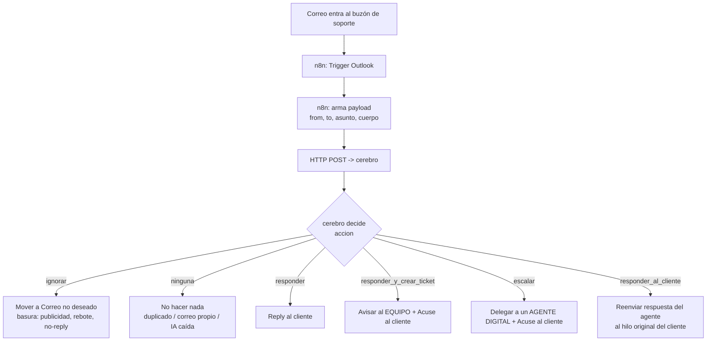

# Arquitectura — Piloto SAC (Soporte Automático de Credenciales)

Este documento explica, en líneas generales, cómo está armado el sistema: sus piezas, cómo fluye un
correo de soporte de principio a fin, y cómo se guardan los datos. Para el detalle de despliegue ver
`SETUP_AWS.md` y `SETUP_N8N.md`.

## 1. Las piezas

| Pieza | Qué es | Rol |
|---|---|---|
| **`apps/carga-credenciales`** | Lambda + web (Function URL) | Sube a Mongo las credenciales de estudiantes y docentes (cifradas). Una web con login para operarlas. |
| **`apps/cerebro`** | Lambda (Function URL) | El "cerebro": recibe cada correo, decide qué hacer con IA (Gemini), busca credenciales, crea tickets/casos, y sirve el **dashboard**. |
| **n8n** (self-hosted) | Orquestador de correo | Vigila el buzón de soporte (Outlook/Graph), llama al cerebro y ejecuta lo que este decide (responder, avisar, mover a spam). |
| **MongoDB Atlas** | Base de datos | Colegios + credenciales, conversaciones, tickets/casos, y correos descartados. |
| **Gemini** (Google AI) | LLM | Decide la intención de cada correo y redacta las respuestas. Plan gratuito con respaldo de modelo. |

Ambas apps son **funciones Lambda** (imagen de contenedor) con **Function URL** pública. Todo cabe en
capa gratuita (ver `SETUP_AWS.md`).

## 2. El flujo de un correo, de principio a fin

El cerebro, ante un correo entrante, resuelve **en este orden**:

1. **¿Es nuestro propio envío?** Si el remitente es un buzón interno (soporte, agente, equipo) → se
   ignora. Evita que el sistema se responda a sí mismo en bucle. (`CUENTAS_SOPORTE`, `esCorreoInterno`)
2. **¿Es basura?** Publicidad, newsletters, buzones `no-reply`, avisos de ausencia, **rebotes/NDR**
   (detectados por asunto **o cuerpo**) → `accion: ignorar`, n8n lo mueve a *Correo no deseado*. No
   gasta cuota de IA. (`utils/clasificacion.js`)
3. **¿Es la respuesta de un agente/equipo a un caso o ticket delegado?** Se reconoce por el
   `conversationId` del aviso que enviamos (no por el asunto) → su respuesta se reenvía al **hilo
   original del cliente**. (`buscarEscalamientoPendiente`, `resolverEscalamiento`)
4. **Si no es nada de lo anterior, es una consulta:** va a Gemini con *function calling*. El modelo
   elige una herramienta: buscar credenciales, crear ticket, derivar a un agente, tutorial de PIN,
   fuera de alcance. (`llm/agente.js`)

## 3. Dos caminos hacia una persona: **Ticket** y **Caso**

Son distintos pero comparten el mismo "viaje de vuelta".

| | **Ticket** | **Caso (escalado)** |
|---|---|---|
| Cuándo | Reseteo de clave, incidencia de plataforma | El asistente no pudo resolverlo |
| Lo atiende | Un **equipo** (Cuentas / Servicio Digital) | Un **agente digital** concreto |
| Qué recibe el cliente al crearse | Un **acuse**: "una persona atenderá tu caso" | Un **acuse**: "un agente atenderá tu caso" |
| Qué recibe la persona | Aviso interno con todos los datos | Correo de delegación con todos los datos |
| Cómo vuelve la respuesta | La persona responde a su aviso → el cerebro la reenvía al cliente | Igual |

**Viaje de vuelta (clave):** al crear un ticket o un caso, n8n registra el `conversationId` del aviso
que envió (`registrar hilo…`). Cuando la persona responde a ese aviso, el cerebro lo reconoce por ese
id y reenvía **solo el contenido útil** (sin el saludo ni la firma personal del agente) al hilo
original del cliente, con la firma corporativa. El cliente nunca ve códigos internos (`PENDIENTE-…` /
`CASO-…`) ni datos de otros estudiantes.

## 3b. Consentimiento de tratamiento de datos

Antes de atender la primera solicitud de un cliente, el cerebro exige que **acepte la política de
tratamiento de datos** (LOPDP). El flujo es 100% por correo (no hay página web ni el correo ejecuta
nada — encaja en el plan gratuito):

1. El cliente escribe pidiendo ayuda. El cerebro, si no tiene su aceptación registrada, responde con
   el **correo de política** y deja el hilo en `esperando_consentimiento`. No atiende la solicitud aún.
2. El cliente **responde `ACEPTO`**. El cerebro registra la aceptación y **atiende la solicitud
   original** que quedó en el historial. Por defecto la aceptación es **por solicitud** (cada hilo de
   correo nuevo la vuelve a pedir — `CONSENTIMIENTO_ALCANCE=correo`); con `=cliente` se pide una vez
   por correo del cliente y dura `CONSENTIMIENTO_VIGENCIA_DIAS`.
3. Si **no acepta** dentro del plazo (`CONSENTIMIENTO_HORAS`, por defecto 48 h), un job programado de
   n8n (`workflow-consentimiento-vencido.json`) **delega su solicitud a un agente humano** (mismo
   viaje de vuelta que un caso) y le avisa que será atendido en **48 a 52 horas**.

En alcance `correo` (por defecto) la aceptación se guarda como una marca en la **conversación**; en
alcance `cliente` se guarda en la colección `consentimientos` (`_id` = correo, `vigenteHasta`). Se
puede desactivar todo con `CONSENTIMIENTO_HABILITADO=false`.

## 4. Reglas de seguridad y privacidad

- **Credenciales cifradas** (AES-256-GCM) en Mongo; se descifran solo al entregarlas al usuario que
  las pidió.
- **Nunca se enumeran estudiantes.** Si hay varias coincidencias parciales, el asistente pide más
  datos; jamás lista nombres de otros alumnos (sería fuga de datos personales).
- **Anti-bucle** en dos capas: n8n vigila solo la Bandeja de entrada, y el cerebro descarta todo
  correo cuyo remitente sea una dirección interna.
- **Cierre por inactividad**: las conversaciones que quedan esperando datos del usuario se cierran a
  las 24 h con un aviso — **pero nunca a una dirección interna** (esas se cierran en silencio).

## 5. Modelo de datos (MongoDB)

| Colección | Guarda | Campos clave |
|---|---|---|
| **`colegios`** | Un doc por colegio | `_id`, `codigo`, `nombre`, ubicación, `estudiantes[]`, `docentes[]` (con `login`/`contrasena` cifrados, `plataforma`, `periodo`) |
| **`conversaciones`** | Un doc por hilo de correo | `_id` = `conversationId`, `remitente`, `asunto`, `estado`, `mensajes[]`, `eventos[]`, `tickets[]` |
| **`escalamientos`** | Un doc por ticket o caso derivado | `_id` = código, `tipo` (`caso`\|`ticket`), `hiloId` original, `agenteEmail`, `estado`, `respuestaAgente`, `conversationIdDelegacion` |
| **`descartes`** | Un correo basura descartado | `remitente`, `asunto`, `categoria`, `senal` (para afinar el filtro) |
| **`consentimientos`** | Aceptación de la política por cliente | `_id` = correo, `aceptadoEn`, `vigenteHasta` |

La **fuente de verdad de la analítica son los `eventos`** de cada conversación (no contadores
aparte): así una métrica nueva se calcula hacia atrás sobre el histórico. El estado de la conversación
(`abierto`, `esperando_usuario`, `esperando_agente`, `resuelto`, `cerrado`, `cerrado_inactividad`)
define quién debe actuar.

### ¿Ticket resuelto y el cliente escribe OTRO problema?

El hilo **queda abierto**: cuando el cliente responde con un problema nuevo en el mismo hilo, el
cerebro lo trata como una consulta nueva y crea un **ticket nuevo**, enlazado al anterior (`enlazadoA`)
para no mezclar categorías ni tiempos de resolución. No se "reabre" el ticket viejo. (Si el cliente
escribe *mientras* un ticket sigue pendiente, hoy podría generarse un segundo ticket; mitigar eso —
detectar que ya hay uno en curso — es una mejora pendiente.)

## 6. Dashboard (`apps/cerebro`, `?vista=dashboard`)

Una sola página autocontenida servida por la Lambda. Dos capas:

- **Agregados**: embudo de resolución, tasa de automatización, tiempos (mediana/p90), credenciales,
  carga por agente, ruido filtrado, salud del sistema.
- **Conversaciones**: tabla de cada hilo (asunto, cliente, categoría, estado, ticket/caso, actividad)
  con búsqueda, filtro por estado y paginación. Al hacer clic, el **hilo completo**: mensajes con el
  correo real de quien escribió, eventos, y la ficha del ticket/caso con la respuesta del agente.

Va protegido con `DASHBOARD_TOKEN` (contiene datos sensibles).

## 7. Despliegue (resumen)

- `docker build` + push a ECR + `update-function-code` para cada Lambda (ver `SETUP_AWS.md`).
- Importar los workflows de `n8n/` y configurar credenciales de Outlook (ver `SETUP_N8N.md`).
- Variables de entorno clave del cerebro: `MONGODB_URI`, `GEMINI_API_KEY`, `CREDENCIALES_ENC_KEY`,
  `AGENTES_DIGITALES`, `CUENTAS_SOPORTE`, `CEREBRO_URL`, `FIRMA_LOGOS`, `DASHBOARD_TOKEN`,
  `CORREO_EQUIPO_CUENTAS`, `CORREO_EQUIPO_SERVICIO_DIGITAL`, `CONSENTIMIENTO_HABILITADO`,
  `CONSENTIMIENTO_HORAS`, `CONSENTIMIENTO_VIGENCIA_DIAS`.
- Workflows de n8n: `workflow-soporte-correo.json` (principal), `workflow-cierre-inactivas.json`
  (cierre 24 h), `workflow-consentimiento-vencido.json` (delegación 48 h).
